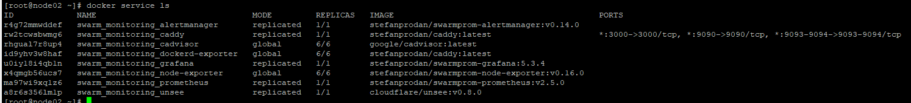

1. Авттозапуск при загрузки
```
[Unit]
Description=nodeexp
Requires=network.target
After=network.target

[Service]
Type=simple
WorkingDirectory=/home/vagrant/node_exporter-1.2.2.linux-amd64/
User=root

Restart=always
RestartSec=10

EnvironmentFile=-/home/vagrant/node_file.conf
 ExecStart=/home/vagrant/node_exporter-1.2.2.linux-amd64/node_exporter -f -P $EXTRA_OPTS
;
[Install]
 WantedBy=multi-user.target
```

2.
node_cpu_seconds_total

node_filesystem_avail_bytes

node_network_receive_bytes_total

node_memory_MemAvailable_bytes

3.


4. 
   [    0.000000] DMI: innotek GmbH VirtualBox/VirtualBox, BIOS VirtualBox 12/01/2006

   [    0.000000] Hypervisor detected: KVM

5.
fs.nr_open - предел открытых файлов на систему
Есть ограничения soft и hard лимит
Количество открытых файлов на процесс  :
open files                      (-n) 1024
open files                      (-n) 1048576

6. 


7.
Данная функция `:(){ :|:& };:` это функция, которая параллельно запускает два своих экземпляра,
увеличивается пока не сработает ограничение по процессам.

`cgroup: fork rejected by pids controller`

ulimit -a -ограничение для пользователя

`max user processes              (-u) 3571`

cat /proc/sys/kernel/pid_max - в системе - 4194304

