1. Разряженные файлы- это файлы, которые завписаны в память без дыр ( нулевых байтов) , для большей плотности хранения информмации
2. Не могут, потому что являются прямыми ссылками на физическое расположение информации на диске.
3. 
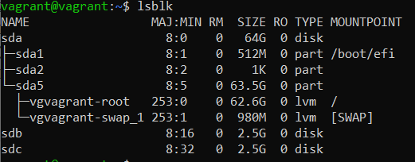

4. 
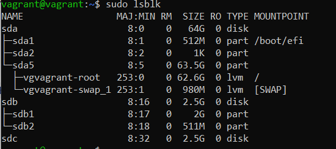

5.
```
   root@vagrant:~# root@vagrant:~# sfdisk /dev/sdc < partitions.txt
   Checking that no-one is using this disk right now ... OK
```
6.`mdadm --create --verbose /dev/md0 -l 1 -n 2 /dev/sd{b,c}1`

   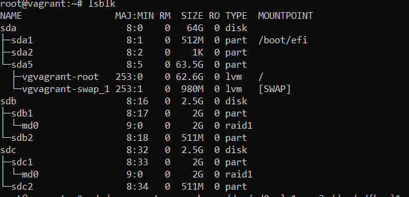
   
7.
````
Disk /dev/md1: 1018 MiB, 1067450368 bytes, 2084864 sectors
Units: sectors of 1 * 512 = 512 bytes
Sector size (logical/physical): 512 bytes / 512 bytes
I/O size (minimum/optimal): 524288 bytes / 1048576 bytes
````
8. 
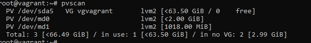

9.
 `vgcreate vol_grp /dev/md0 /dev/md1`
10. 
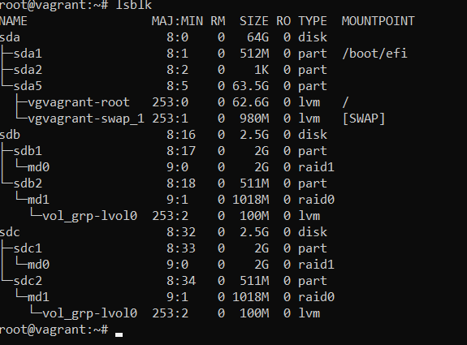
11.
`mke2fs -t ext4  /dev/mapper/vol_grp-lvol0`
12.
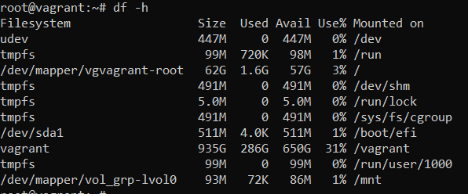
13.
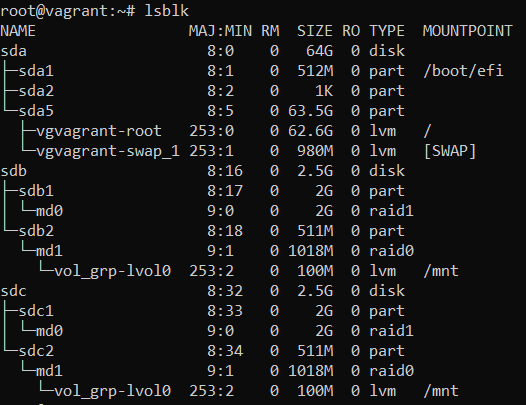
14.
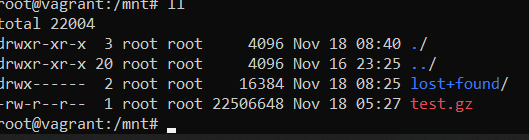
15.
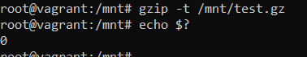
16.
`pvmove -i5 /dev/md1 /dev/md0`
17.
`mdadm /dev/md0 --fail /dev/sdb1`
18.
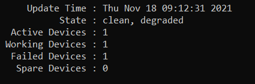
19.
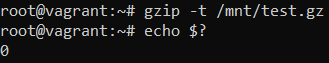
20. end
