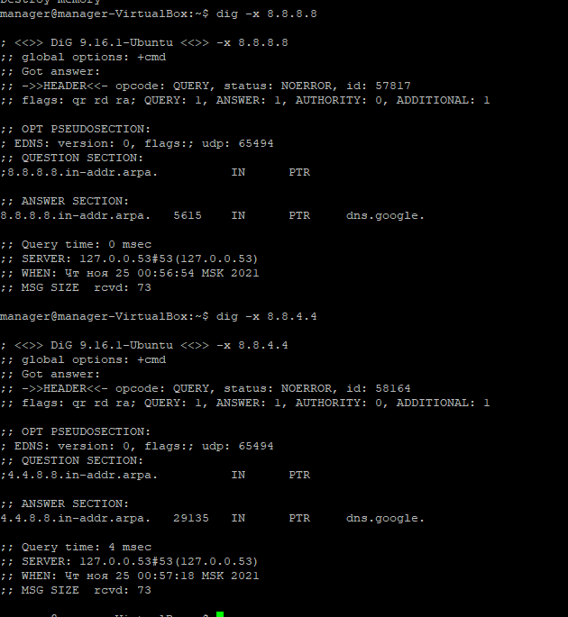

1.

Ответ оповешает о том , что запрашиваемая страница доступна по протоколу https.

2.
````
HTTP/2 200 OK
cache-control: private
content-type: text/html; charset=utf-8
content-encoding: gzip
strict-transport-security: max-age=15552000
x-frame-options: SAMEORIGIN
x-request-guid: 94bb084d-ba45-4cec-9efb-751bf4ce1297
feature-policy: microphone 'none'; speaker 'none'
content-security-policy: upgrade-insecure-requests; frame-ancestors 'self' https://stackexchange.com
accept-ranges: bytes
date: Wed, 24 Nov 2021 15:25:44 GMT
via: 1.1 varnish
x-served-by: cache-bma1639-BMA
x-cache: MISS
x-cache-hits: 0
x-timer: S1637767544.376044,VS0,VE104
vary: Accept-Encoding,Fastly-SSL
x-dns-prefetch-control: off
X-Firefox-Spdy: h2
````

2.


3. 171.25.166.217

4.


5.


6.
 `mtr -y 0 8.8.8.8`

Самый большой delay
 `3. AS42765  p2sr-e38sr.line-r.ru         0.0%    46    1.9   7.5   1.1 139.6  21.2`

7.

 SERVER: 127.0.0.53

 dns.google.             464     IN      A       8.8.8.8
dns.google.             464     IN      A       8.8.4.4

8.

