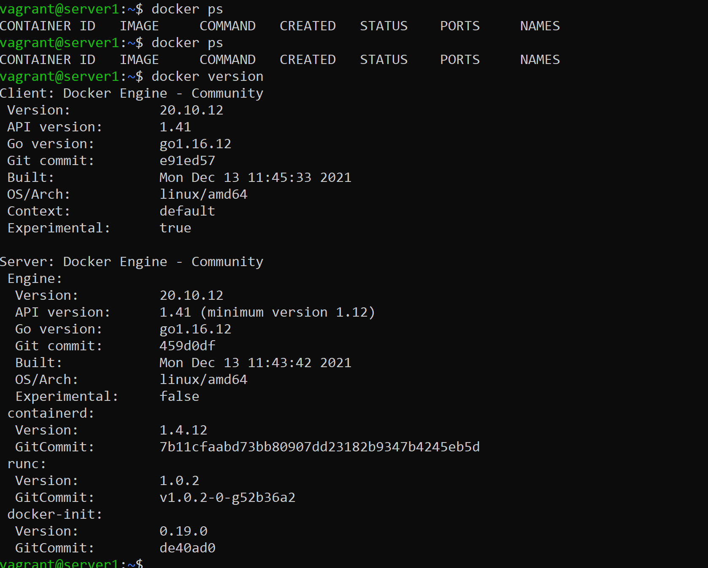

1. IaaC -ускоряет процесс предоставления инфраструктуры для разработки, тестирования. Приводит среду разработки\тестирования к единой конйигурации.
    позволяет упростить предоставление инфраструктуры тем самым ускоряет каждый этап жизненного цикла доставки ПО. 
    Главный прирнцип - инфраструктура, как код, вся инфраструктура и настройка шдолжны ьыть описнаа и быстро и легко в случае необходимости развернута.


2. Ansible - хорош тем, что использует стандартное SSH подключение для внесения изменений в конфигурацию, что не требует установки доп клиента и мгновенно отображает журнал происходящего!
    Push  метод более надежный, так как можно онлайн видеть выполнение конфигурации, либо мнгновенно ловить ошибки и есть возможность устранить их.


3. 

```khordv@LTP-IT-025:~$ ansible --version
ansible [core 2.12.2]
  config file = None
  configured module search path = ['/home/khordv/.ansible/plugins/modules', '/usr/share/ansible/plugins/modules']
  ansible python module location = /home/khordv/.local/lib/python3.8/site-packages/ansible
  ansible collection location = /home/khordv/.ansible/collections:/usr/share/ansible/collections
  executable location = /home/khordv/.local/bin/ansible
  python version = 3.8.10 (default, Nov 26 2021, 20:14:08) [GCC 9.3.0]
  jinja version = 2.10.1
  libyaml = True
  ```
```buildoutcfg
c:\HashiCorp\iaac>vagrant --version
Vagrant 2.2.19
```
```buildoutcfg
Графический интерфейс VirtualBox
Версия 6.1.32 r149290 (Qt5.6.2)
Copyright © 2022 Oracle Corporation and/or its affiliates. All rights reserved.
```
4. 



