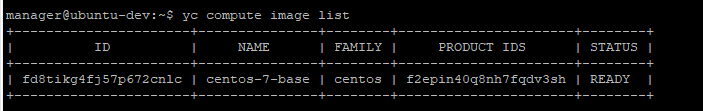
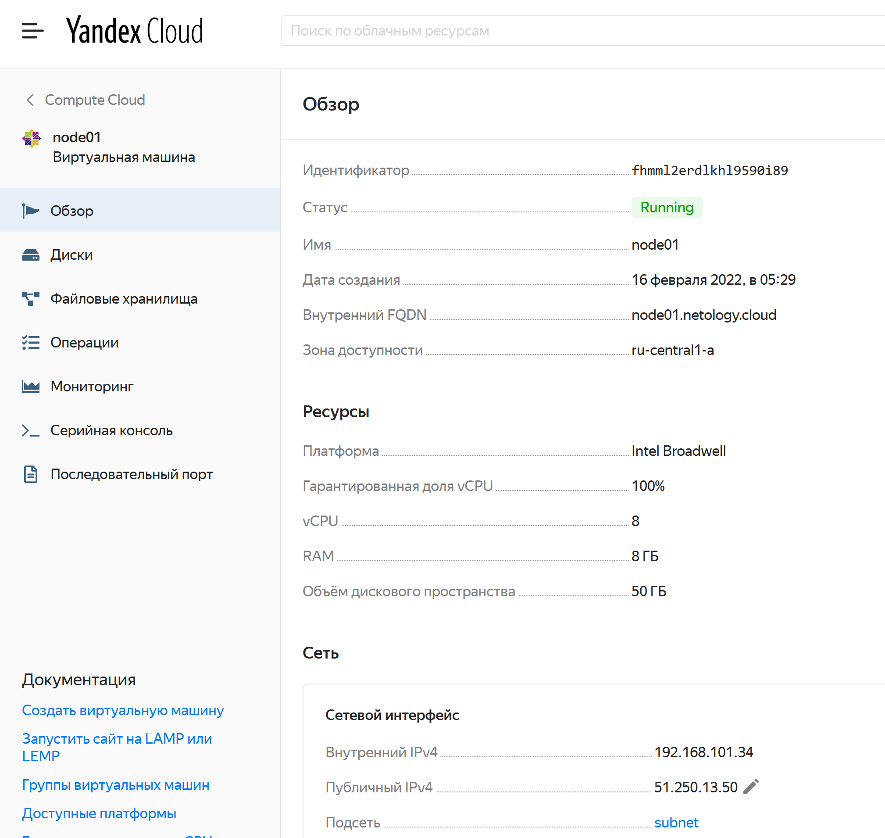
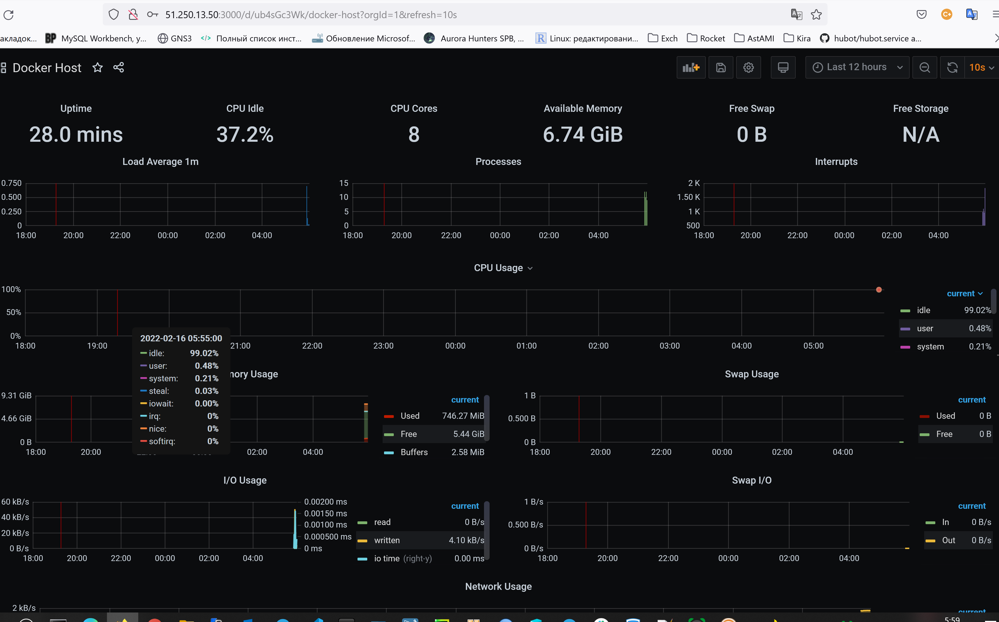

1.

2.

3.

4. Не получилось выполнить задание, просьба помочь или хотя бы подсказать где ошибки, 
перепробывал все для себя возможные варианты варианты которые придумал.
---
Получилось создать две виртуальных машины, распространить плэйбук для каждой, но 
не получается добавить мониторинг второй виртуальной машины в прометеуз\графана, 
а когда дописываю предполагаемое правило так и перестает работать и графана.

---

Файлы конфига прикреплю к дз
