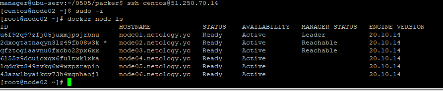

**1.1**

*Не нашел способов открыть счет\карту в другой стране не приезжая туда*
Очень бы хотелось попробовать, но...нет, смотрел только YC.

**1**

 Packer для создания образа.

**2** 

Зарегистрировал провайдера yandex cloud(авторизация по сервисному ключу-файлу, не находящемуся в папке terraform, создается VM из образа Centos-7 (по id публичного образа в yandex cloud) + сеть (внутренняя и внешний интернет IP, а так же передается публичный ключ ssh для последующей авторизации на VM.

https://github.com/khordv/devops-netology/tree/main/7_2-terraform 
